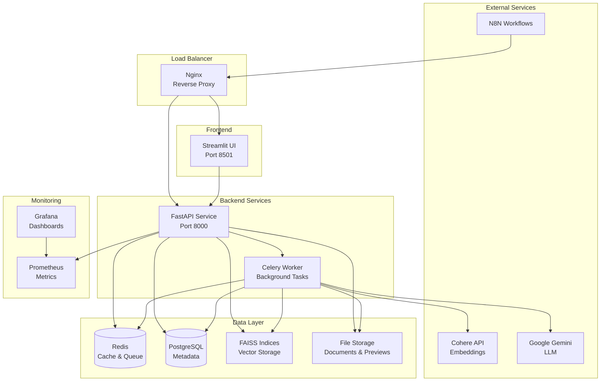

# 🔍 Production-Ready Multimodal RAG System with N8N Integration

A comprehensive, Docker-Compose based multimodal Retrieval-Augmented Generation (RAG) system that enables semantic search across text and images in PDF documents, with full N8N workflow automation support.

## 📋 Table of Contents

- [Overview](#overview)
- [Architecture](#architecture)
- [Features](#features)
- [Prerequisites](#prerequisites)
- [Quick Start](#quick-start)
- [Detailed Installation](#detailed-installation)
- [API Documentation](#api-documentation)
- [N8N Integration](#n8n-integration)
- [UI Usage Guide](#ui-usage-guide)
- [Configuration](#configuration)
- [Monitoring & Logging](#monitoring--logging)
- [Security](#security)
- [Performance Tuning](#performance-tuning)
- [Troubleshooting](#troubleshooting)
- [Development](#development)
- [Contributing](#contributing)
- [License](#license)

## 🎯 Overview

This system transforms your PDF documents into a searchable knowledge base using state-of-the-art AI technologies:

- **Multimodal Embeddings**: Cohere Embed-v4.0 for both text and image understanding
- **Advanced LLM**: Google Gemini 2.5 Flash for intelligent answer generation
- **Vector Search**: FAISS for high-performance similarity search
- **Production Ready**: Docker-Compose deployment with monitoring and security
- **N8N Integration**: Comprehensive API for workflow automation
- **Scalable Architecture**: Microservices design with background task processing

### Use Cases

- 📚 **Document Knowledge Base**: Search through technical documentation, reports, and manuals
- 🏢 **Enterprise Search**: Find information across company documents and presentations
- 📊 **Research Assistant**: Extract insights from research papers and analytical reports
- 🤖 **Workflow Automation**: Integrate with N8N for automated document processing pipelines
- 📈 **Business Intelligence**: Query financial reports, charts, and data visualizations

## 🏗️ Architecture



### Component Responsibilities

| Component | Purpose | Technology |
|-----------|---------|------------|
| **Nginx** | Load balancing, SSL termination, rate limiting | Nginx Alpine |
| **FastAPI** | REST API, authentication, request handling | Python 3.11 |
| **Streamlit** | Interactive web UI for document management | Streamlit |
| **Celery Worker** | Background document processing | Celery + Redis |
| **PostgreSQL** | User data, document metadata, task status | PostgreSQL 15 |
| **Redis** | Caching, rate limiting, task queue | Redis 7 |
| **FAISS** | Vector similarity search | FAISS CPU |
| **Prometheus** | Metrics collection and alerting | Prometheus |
| **Grafana** | Monitoring dashboards and visualization | Grafana |

## ✨ Features

### Core Functionality
- 📄 **PDF Processing**: Extract text and images from uploaded PDFs
- 🔍 **Multimodal Search**: Search across both text content and visual elements
- 🤖 **AI Answers**: Generate contextual answers using retrieved content
- 📊 **Real-time Analytics**: Track search performance and usage patterns
- 🔐 **Secure Authentication**: API key-based authentication with rate limiting

### Production Features
- 🐳 **Docker Compose Deployment**: One-command deployment with all services
- 🔄 **Background Processing**: Asynchronous document processing with progress tracking
- 📈 **Monitoring & Metrics**: Comprehensive observability with Prometheus and Grafana
- 🛡️ **Security Hardening**: SSL/TLS, input validation, secure configurations
- 🚀 **Performance Optimization**: Caching, connection pooling, resource limits
- 📝 **Comprehensive Logging**: Structured logging with configurable levels

### N8N Integration
- 🌐 **REST API**: Full REST API for all operations
- 🪝 **Webhooks**: N8N-compatible webhook endpoints
- 📦 **Batch Operations**: Support for bulk document processing
- ⚡ **Async Operations**: Long-running tasks with status tracking
- 🔗 **Workflow Examples**: Pre-built N8N workflow templates

## 🔧 Prerequisites

### System Requirements

| Component | Minimum | Recommended |
|-----------|---------|-------------|
| **OS** | Ubuntu 20.04 LTS | Ubuntu 22.04 LTS |
| **CPU** | 2 cores | 4+ cores |
| **RAM** | 4 GB | 8+ GB |
| **Storage** | 20 GB | 50+ GB SSD |
| **Network** | 1 Mbps | 10+ Mbps |

### Software Dependencies

- **Docker**: Version 20.10+
- **Docker Compose**: Version 2.0+
- **Git**: For cloning the repository
- **curl**: For health checks and testing

### API Keys Required

- **Cohere API Key**: Get from [Cohere Dashboard](https://dashboard.cohere.com/)
- **Google Gemini API Key**: Get from [Google AI Studio](https://aistudio.google.com/)

## 🚀 Quick Start

### 1. Clone Repository
```bash
git clone https://github.com/your-username/multimodal-rag-system.git
cd multimodal-rag-system
```

### 2. Configure Environment
```bash
# Copy environment template
cp .env.example .env

# Edit .env file with your API keys
nano .env
```

**Required configurations in `.env`:**
```bash
COHERE_API_KEY=your_cohere_api_key_here
GEMINI_API_KEY=your_gemini_api_key_here
```

### 3. Deploy System
```bash
# Make deploy script executable
chmod +x scripts/deploy.sh

# Run deployment script (Ubuntu/Debian)
./scripts/deploy.sh
```

### 4. Access Services
- **Main UI**: http://localhost
- **API Docs**: http://localhost/api/docs
- **Monitoring**: http://localhost:3000 (Grafana)

## 📖 Detailed Installation

### Manual Installation Steps

#### 1. System Preparation
```bash
# Update system
sudo apt update && sudo apt upgrade -y

# Install prerequisites
sudo apt install -y curl wget git unzip apt-transport-https ca-certificates gnupg lsb-release poppler-utils

# Install Docker
curl -fsSL https://get.docker.com -o get-docker.sh
sudo sh get-docker.sh
sudo usermod -aG docker $USER

# Install Docker Compose
sudo curl -L "https://github.com/docker/compose/releases/latest/download/docker-compose-$(uname -s)-$(uname -m)" -o /usr/local/bin/docker-compose
sudo chmod +x /usr/local/bin/docker-compose

# Log out and back in to apply group changes
```

#### 2. Application Setup
```bash
# Create application directory
sudo mkdir -p /opt/multimodal-rag
sudo chown $USER:$USER /opt/multimodal-rag
cd /opt/multimodal-rag

# Clone repository
git clone https://github.com/your-username/multimodal-rag-system.git .

# Create data directories
mkdir -p data/{uploads,faiss_indices,previews,logs}
mkdir -p logs/{api,ui,worker,nginx}
```

#### 3. Environment Configuration
```bash
# Copy and edit environment file
cp .env.example .env

# Generate secure secrets
API_SECRET_KEY=$(openssl rand -hex 32)
REDIS_PASSWORD=$(openssl rand -hex 16)
POSTGRES_PASSWORD=$(openssl rand -hex 16)

# Update .env file with generated secrets and your API keys
```

#### 4. SSL Certificate Setup (Production)
```bash
# For production with domain name
sudo certbot --nginx -d your-domain.com

# For development (self-signed)
sudo mkdir -p /etc/nginx/ssl
sudo openssl req -x509 -nodes -days 365 -newkey rsa:2048 \
    -keyout /etc/nginx/ssl/key.pem \
    -out /etc/nginx/ssl/cert.pem
```

#### 5. Deploy Services
```bash
# Build and start all services
docker-compose build
docker-compose up -d

# Check service health
docker-compose ps
docker-compose logs -f
```

### Verification Steps

```bash
# Check all services are running
docker-compose ps

# Test API health
curl http://localhost/health

# Test UI access
curl -I http://localhost

# Check logs for any errors
docker-compose logs --tail=50
```

## 📚 API Documentation

### Authentication

All API endpoints require authentication using API keys in the Authorization header:

```bash
curl -H "Authorization: Bearer YOUR_API_KEY" http://localhost/api/documents
```

### Core Endpoints

#### Document Management

**Upload Documents**
```http
POST /api/documents/upload
Content-Type: multipart/form-data
Authorization: Bearer YOUR_API_KEY

files: [PDF files]
```

**List Documents**
```http
GET /api/documents
Authorization: Bearer YOUR_API_KEY
```

**Delete Document**
```http
DELETE /api/documents/{document_id}
Authorization: Bearer YOUR_API_KEY
```

#### Search Operations

**Search Documents**
```http
POST /api/search
Content-Type: application/json
Authorization: Bearer YOUR_API_KEY

{
  "query": "What is the main topic?",
  "top_k": 5,
  "include_answer": true,
  "filters": {}
}
```

#### Task Management

**Get Task Status**
```http
GET /api/tasks/{task_id}
Authorization: Bearer YOUR_API_KEY
```

**List User Tasks**
```http
GET /api/tasks?limit=10
Authorization: Bearer YOUR_API_KEY
```

### N8N Integration Endpoints

#### Webhook Search
```http
POST /api/n8n/webhook/search?webhook_secret=YOUR_SECRET
Content-Type: application/json

{
  "query": "search query",
  "user_id": "user_uuid",
  "options": {
    "top_k": 5,
    "include_answer": true
  }
}
```

#### Webhook Upload
```http
POST /api/n8n/webhook/upload
Content-Type: multipart/form-data

files: [PDF files]
user_id: user_uuid
webhook_secret: YOUR_SECRET
```

### Response Formats

**Success Response**
```json
{
  "success": true,
  "data": { ... },
  "message": "Operation completed",
  "timestamp": "2024-01-01T00:00:00Z"
}
```

**Error Response**
```json
{
  "success": false,
  "error_code": "VALIDATION_ERROR",
  "message": "Invalid input",
  "details": { ... },
  "timestamp": "2024-01-01T00:00:00Z"
}
```

### Rate Limiting

- **Default Rate**: 60 requests per minute per API key
- **Burst Allowance**: 10 additional requests
- **Headers**: Rate limit info in response headers

```
X-RateLimit-Limit: 60
X-RateLimit-Remaining: 45
X-RateLimit-Reset: 1640995200
```

## 🔗 N8N Integration

### Setup N8N Connection

1. **Create API Key**
```bash
# Generate API key for N8N user
curl -X POST http://localhost/api/auth/api-key \
  -H "Content-Type: application/json" \
  -d '{"email": "n8n@yourcompany.com", "description": "N8N Integration"}'
```

2. **Configure N8N HTTP Node**
- **URL**: `http://your-server/api/`
- **Authentication**: Bearer Token
- **Token**: Your generated API key

### Example N8N Workflows

#### 1. Document Processing Workflow

```json
{
  "name": "Process Documents from Email",
  "nodes": [
    {
      "name": "Email Trigger",
      "type": "n8n-nodes-base.emailReadImap",
      "parameters": {
        "mailbox": "INBOX",
        "format": "resolved"
      }
    },
    {
      "name": "Extract Attachments",
      "type": "n8n-nodes-base.extractFromFile",
      "parameters": {
        "binaryProperty": "attachment_0"
      }
    },
    {
      "name": "Upload to RAG System",
      "type": "n8n-nodes-base.httpRequest",
      "parameters": {
        "url": "http://your-server/api/n8n/webhook/upload",
        "method": "POST",
        "sendBinaryData": true,
        "binaryPropertyName": "files",
        "options": {
          "formData": {
            "user_id": "={{ $json.user_id }}",
            "webhook_secret": "YOUR_WEBHOOK_SECRET"
          }
        }
      }
    }
  ]
}
```

#### 2. Automated Search Workflow

```json
{
  "name": "Slack Question Answering",
  "nodes": [
    {
      "name": "Slack Trigger",
      "type": "n8n-nodes-base.slackTrigger",
      "parameters": {
        "channel": "general"
      }
    },
    {
      "name": "Search RAG System",
      "type": "n8n-nodes-base.httpRequest",
      "parameters": {
        "url": "http://your-server/api/n8n/webhook/search",
        "method": "POST",
        "body": {
          "query": "={{ $json.text }}",
          "user_id": "team_user_id",
          "options": {
            "top_k": 3,
            "include_answer": true
          }
        },
        "options": {
          "queryParameters": {
            "webhook_secret": "YOUR_WEBHOOK_SECRET"
          }
        }
      }
    },
    {
      "name": "Reply to Slack",
      "type": "n8n-nodes-base.slack",
      "parameters": {
        "operation": "postMessage",
        "channel": "={{ $node['Slack Trigger'].json.channel }}",
        "text": "🤖 {{ $json.data.answer }}"
      }
    }
  ]
}
```

#### 3. Batch Processing Workflow

```json
{
  "name": "Daily Document Processing",
  "nodes": [
    {
      "name": "Cron Trigger",
      "type": "n8n-nodes-base.cron",
      "parameters": {
        "triggerTimes": {
          "hour": 2,
          "minute": 0
        }
      }
    },
    {
      "name": "Check Folder",
      "type": "n8n-nodes-base.ftp",
      "parameters": {
        "operation": "list",
        "path": "/incoming/documents/"
      }
    },
    {
      "name": "Process Each File",
      "type": "n8n-nodes-base.splitInBatches",
      "parameters": {
        "batchSize": 5
      }
    },
    {
      "name": "Upload to RAG",
      "type": "n8n-nodes-base.httpRequest",
      "parameters": {
        "url": "http://your-server/api/n8n/webhook/upload",
        "method": "POST"
      }
    }
  ]
}
```

### N8N Best Practices

1. **Error Handling**: Always include error handling nodes
2. **Rate Limiting**: Respect API rate limits with delays
3. **Monitoring**: Set up workflow monitoring and alerts
4. **Security**: Use environment variables for secrets
5. **Testing**: Test workflows with small datasets first

## 🖥️ UI Usage Guide

### Getting Started

1. **Access the UI**: Open http://localhost in your browser
2. **Connect to API**: Enter your API key in the sidebar
3. **Upload Documents**: Use the Documents tab to upload PDFs
4. **Search Content**: Use the Search tab to query your documents

### Documents Tab

#### Uploading Documents
1. Click "Choose PDF files" button
2. Select one or more PDF files (max 50MB each)
3. Click "🚀 Process Documents"
4. Monitor processing status in real-time

#### Managing Documents
- **View Statistics**: See total documents, storage usage, and content distribution
- **Document List**: Browse uploaded documents with metadata
- **Delete Documents**: Remove documents and their embeddings

### Search Tab

#### Basic Search
1. Enter your question in natural language
2. Select number of results to show (3-15)
3. Choose whether to generate AI answers
4. Click "🔍 Search"

#### Understanding Results
- **AI Answer**: Generated response based on best matching content
- **Search Results**: Ranked list of relevant text and image content
- **Similarity Scores**: Confidence scores for each result
- **Preview Images**: Visual content from PDFs when available

#### Advanced Search Tips
- **Specific Queries**: "What is the revenue for Q3?" 
- **Comparative Queries**: "Compare performance between divisions"
- **Visual Queries**: "Show charts about market trends"
- **Concept Queries**: "Explain the main strategy"

### Analytics Tab

#### Search History
- View all previous searches with timestamps
- Analyze search patterns and frequency
- Export search history as CSV

#### Performance Metrics
- Average processing time per search
- Search results distribution
- Daily search activity charts

#### Usage Insights
- Most common query types
- Success rate of searches
- Peak usage times

### Settings Tab

#### Search Configuration
- **Default Results Count**: Set preferred number of results
- **AI Answers**: Enable/disable automatic answer generation
- **Result Filters**: Configure content type preferences

#### Data Management
- **Export Data**: Download search history and analytics
- **Clear History**: Reset search history
- **Refresh Data**: Reload documents and statistics

#### UI Preferences
- **Theme Selection**: Choose light, dark, or auto theme
- **Advanced Options**: Show/hide advanced features
- **Notification Settings**: Configure alerts and updates

### Troubleshooting UI Issues

**Connection Problems**
- Verify API key is correct
- Check API service is running: `docker-compose ps`
- Review API logs: `docker-compose logs rag-api`

**Upload Issues**
- Ensure PDF files are under 50MB
- Check file format is valid PDF
- Verify sufficient storage space

**Search Problems**
- Confirm documents are processed (status: "processed")
- Try different query phrasings
- Check for special characters in queries

## ⚙️ Configuration

### Environment Variables

#### Core Configuration
```bash
# API Configuration
API_SECRET_KEY=your_very_secure_secret_key_here
API_HOST=0.0.0.0
API_PORT=8000
DEBUG=false

# AI Model Configuration
COHERE_API_KEY=your_cohere_api_key_here
GEMINI_API_KEY=your_gemini_api_key_here
GEMINI_MODEL=gemini-2.5-flash-preview-04-17
EMBEDDING_MODEL=embed-v4.0

# Database Configuration
POSTGRES_DB=multimodal_rag
POSTGRES_USER=rag_user
POSTGRES_PASSWORD=secure_postgres_password
DATABASE_ECHO=false
DATABASE_POOL_SIZE=10

# Redis Configuration
REDIS_PASSWORD=secure_redis_password
REDIS_MAX_CONNECTIONS=10

# File Upload Limits
MAX_FILE_SIZE_MB=50
SUPPORTED_FILE_TYPES=["pdf"]
MAX_CONCURRENT_UPLOADS=5

# Rate Limiting
RATE_LIMIT_PER_MINUTE=60
RATE_LIMIT_BURST=10

# Storage Paths
DATA_VOLUME_PATH=/app/data
FAISS_INDEX_PATH=faiss_indices
UPLOAD_PATH=uploads
PREVIEW_PATH=previews

# N8N Integration
N8N_WEBHOOK_SECRET=n8n_webhook_secret
N8N_API_KEY=n8n_api_key
N8N_BASE_URL=http://n8n:5678

# Monitoring
LOG_LEVEL=INFO
ENABLE_METRICS=true
GRAFANA_PASSWORD=admin_secure_password

# SSL Configuration (Production)
SSL_CERT_PATH=/etc/nginx/ssl/cert.pem
SSL_KEY_PATH=/etc/nginx/ssl/key.pem
```

#### Performance Tuning
```bash
# Worker Configuration
WORKER_PROCESSES=4
WORKER_THREADS=1
CELERY_TASK_TIMEOUT=3600

# Search Configuration
DEFAULT_TOP_K=5
MAX_TOP_K=20
SEARCH_TIMEOUT=30

# Document Processing
MAX_TEXT_CHUNK_SIZE=1000
TEXT_OVERLAP=200
IMAGE_DPI=200
MAX_IMAGE_SIZE=1568000  # 1568x1568
```

### Docker Compose Customization

#### Resource Limits
```yaml
services:
  rag-api:
    deploy:
      resources:
        limits:
          cpus: '2.0'
          memory: 4G
        reservations:
          cpus: '1.0'
          memory: 2G
```

#### Volume Configuration
```yaml
volumes:
  rag_data:
    driver: local
    driver_opts:
      type: none
      device: /mnt/fast-storage/rag-data
      o: bind
```

#### Network Configuration
```yaml
networks:
  rag_network:
    driver: bridge
    ipam:
      config:
        - subnet: 172.20.0.0/16
          gateway: 172.20.0.1
```

### Advanced Configuration

#### Custom Embedding Models
```python
# core/embeddings.py customization
CUSTOM_EMBEDDING_CONFIG = {
    "model": "embed-v4.0",
    "input_type": "search_document", 
    "embedding_types": ["float"],
    "truncate": "END"
}
```

#### Custom Search Configuration
```python
# api/services/search_service.py customization
SEARCH_CONFIG = {
    "similarity_threshold": 0.7,
    "max_results": 20,
    "rerank_results": True,
    "filter_duplicates": True
}
```

## 📊 Monitoring & Logging

### Prometheus Metrics

#### Application Metrics
- `multimodal_rag_requests_total`: Total HTTP requests
- `multimodal_rag_request_duration_seconds`: Request processing time
- `multimodal_rag_document_processing_duration_seconds`: Document processing time
- `multimodal_rag_search_duration_seconds`: Search operation time
- `multimodal_rag_active_users`: Currently active users
- `multimodal_rag_storage_usage_bytes`: Storage utilization

#### System Metrics
- CPU usage per service
- Memory consumption
- Disk I/O and storage usage
- Network traffic
- Container health status

### Grafana Dashboards

#### Main Dashboard Widgets
1. **System Overview**: Service health, uptime, response times
2. **Usage Analytics**: Daily active users, search volume, popular queries
3. **Performance Metrics**: API response times, search latency, error rates
4. **Resource Utilization**: CPU, memory, disk, network usage per service
5. **Error Tracking**: Error rates, failed requests, system alerts

#### Custom Alerts
```yaml
# Grafana Alert Rules
- alert: HighErrorRate
  expr: rate(multimodal_rag_requests_total{status="error"}[5m]) > 0.1
  for: 2m
  labels:
    severity: warning
  annotations:
    summary: "High error rate detected"

- alert: SlowSearchResponse
  expr: histogram_quantile(0.95, multimodal_rag_search_duration_seconds) > 10
  for: 1m
  labels:
    severity: critical
  annotations:
    summary: "Search responses are slow"
```

### Log Management

#### Structured Logging Format
```json
{
  "timestamp": "2024-01-01T00:00:00Z",
  "level": "INFO",
  "service": "rag-api",
  "module": "search_service",
  "message": "Search completed",
  "user_id": "user_123",
  "query": "search query",
  "processing_time": 1.23,
  "results_count": 5
}
```

#### Log Aggregation
```bash
# View logs from all services
docker-compose logs -f

# View specific service logs
docker-compose logs -f rag-api

# Search logs with grep
docker-compose logs | grep ERROR

# Export logs for analysis
docker-compose logs --since="24h" > system_logs.txt
```

#### Log Rotation
```bash
# /etc/logrotate.d/multimodal-rag
/opt/multimodal-rag/logs/*.log {
    daily
    missingok
    rotate 52
    compress
    delaycompress
    notifempty
    create 644 rag rag
    postrotate
        docker-compose -f /opt/multimodal-rag/docker-compose.yml restart nginx
    endscript
}
```

### Health Checks

#### Automated Health Monitoring
```bash
#!/bin/bash
# scripts/health-check.sh

# Check API health
curl -f http://localhost/health || echo "API health check failed"

# Check UI health  
curl -f http://localhost/_stcore/health || echo "UI health check failed"

# Check database connectivity
docker-compose exec postgres pg_isready -U rag_user || echo "Database check failed"

# Check Redis connectivity
docker-compose exec redis redis-cli ping || echo "Redis check failed"
```

#### Service Dependencies
```yaml
# docker-compose.yml health checks
healthcheck:
  test: ["CMD", "curl", "-f", "http://localhost:8000/health"]
  interval: 30s
  timeout: 10s
  retries: 3
  start_period: 40s
```

## 🔒 Security

### Authentication & Authorization

#### API Key Management
- **Secure Generation**: Cryptographically secure random keys
- **Hashed Storage**: Keys stored as SHA-256 hashes
- **Rotation Support**: Ability to regenerate keys
- **Scope Limiting**: Role-based access control

#### Rate Limiting
```python
# Redis-based sliding window rate limiting
RATE_LIMIT_CONFIG = {
    "requests_per_minute": 60,
    "burst_allowance": 10,
    "window_size_seconds": 60,
    "block_duration_seconds": 300
}
```

### Input Validation & Sanitization

#### File Upload Security
```python
# Secure file validation
def validate_upload(file):
    # Check file size
    if file.size > MAX_FILE_SIZE:
        raise ValidationError("File too large")
    
    # Validate MIME type
    if not file.content_type == "application/pdf":
        raise ValidationError("Invalid file type")
    
    # Scan file content
    if scan_for_malware(file):
        raise SecurityError("Malicious content detected")
```

#### Query Sanitization
```python
# SQL injection prevention
def sanitize_query(query):
    # Remove dangerous patterns
    forbidden_patterns = [';', '--', '/*', '*/', 'xp_', 'exec']
    for pattern in forbidden_patterns:
        if pattern in query.lower():
            raise ValidationError("Invalid query pattern")
    return query
```

### Network Security

#### SSL/TLS Configuration
```nginx
# nginx/nginx.conf SSL settings
ssl_protocols TLSv1.2 TLSv1.3;
ssl_ciphers ECDHE-ECDSA-AES128-GCM-SHA256:ECDHE-RSA-AES128-GCM-SHA256;
ssl_prefer_server_ciphers off;
ssl_session_cache shared:SSL:10m;
ssl_session_timeout 10m;

# HSTS header
add_header Strict-Transport-Security "max-age=31536000; includeSubDomains" always;
```

#### Firewall Configuration
```bash
# UFW firewall rules
sudo ufw default deny incoming
sudo ufw default allow outgoing
sudo ufw allow ssh
sudo ufw allow 80/tcp
sudo ufw allow 443/tcp
sudo ufw enable
```

### Data Protection

#### Sensitive Data Handling
- **Environment Variables**: Store secrets in environment variables
- **Vault Integration**: Support for HashiCorp Vault
- **Data Encryption**: Encrypt sensitive data at rest
- **Audit Logging**: Log all data access and modifications

#### Privacy Compliance
```python
# Data retention policies
DATA_RETENTION_POLICY = {
    "user_data": "2 years",
    "search_logs": "1 year", 
    "document_metadata": "indefinite",
    "temporary_files": "24 hours"
}
```

### Container Security

#### Security Hardening
```dockerfile
# Non-root user in containers
RUN groupadd -r appuser && useradd -r -g appuser appuser
USER appuser

# Remove unnecessary packages
RUN apt-get remove -y wget curl && \
    apt-get autoremove -y && \
    rm -rf /var/lib/apt/lists/*

# Read-only root filesystem
--read-only --tmpfs /tmp:rw,noexec,nosuid,size=100m
```

#### Resource Limits
```yaml
# Docker Compose security constraints
security_opt:
  - no-new-privileges:true
cap_drop:
  - ALL
cap_add:
  - CHOWN
  - SETGID
  - SETUID
```

### Security Monitoring

#### Intrusion Detection
```bash
# Monitor suspicious activities
tail -f /var/log/nginx/access.log | grep -E "(SELECT|UNION|DROP|INSERT)" | \
    mail -s "Potential SQL injection attempt" admin@company.com
```

#### Security Headers
```nginx
# Security headers in Nginx
add_header X-Frame-Options DENY;
add_header X-Content-Type-Options nosniff;
add_header X-XSS-Protection "1; mode=block";
add_header Referrer-Policy "strict-origin-when-cross-origin";
add_header Content-Security-Policy "default-src 'self'";
```

## 🚀 Performance Tuning

### Database Optimization

#### PostgreSQL Tuning
```sql
-- postgresql.conf optimizations
shared_buffers = 256MB
effective_cache_size = 1GB
maintenance_work_mem = 64MB
checkpoint_completion_target = 0.9
wal_buffers = 16MB
default_statistics_target = 100
random_page_cost = 1.1
effective_io_concurrency = 200
```

#### Query Optimization
```sql
-- Add database indexes for better performance
CREATE INDEX CONCURRENTLY idx_documents_user_status 
ON documents(user_id, status) WHERE status = 'processed';

CREATE INDEX CONCURRENTLY idx_search_logs_timestamp 
ON search_logs(timestamp) WHERE timestamp > NOW() - INTERVAL '30 days';

-- Analyze query performance
EXPLAIN ANALYZE SELECT * FROM documents WHERE user_id = 'user_123';
```

### FAISS Optimization

#### Index Configuration
```python
# Optimized FAISS index setup
def create_optimized_index(dimension, num_vectors):
    if num_vectors < 10000:
        # Use flat index for small datasets
        index = faiss.IndexFlatL2(dimension)
    elif num_vectors < 100000:
        # Use IVF index for medium datasets
        quantizer = faiss.IndexFlatL2(dimension)
        index = faiss.IndexIVFFlat(quantizer, dimension, 100)
    else:
        # Use IVF-PQ index for large datasets
        quantizer = faiss.IndexFlatL2(dimension)
        index = faiss.IndexIVFPQ(quantizer, dimension, 1000, 8, 8)
    
    return index
```

#### Memory Management
```python
# Efficient vector processing
def batch_add_vectors(index, vectors, batch_size=1000):
    for i in range(0, len(vectors), batch_size):
        batch = vectors[i:i+batch_size]
        index.add(np.array(batch).astype('float32'))
        
        # Clear memory
        if i % (batch_size * 10) == 0:
            gc.collect()
```

### Caching Strategy

#### Redis Caching
```python
# Multi-level caching strategy
CACHE_CONFIG = {
    "embedding_cache_ttl": 3600,  # 1 hour
    "search_results_ttl": 300,    # 5 minutes
    "user_session_ttl": 1800,     # 30 minutes
    "document_metadata_ttl": 86400 # 24 hours
}

def get_cached_embeddings(text_hash):
    cache_key = f"embedding:{text_hash}"
    cached = redis_client.get(cache_key)
    if cached:
        return json.loads(cached)
    return None
```

#### Application-Level Caching
```python
# In-memory caching for frequently accessed data
from functools import lru_cache

@lru_cache(maxsize=128)
def get_user_permissions(user_id):
    # Cache user permissions in memory
    return fetch_user_permissions(user_id)
```

### Async Processing

#### Background Task Optimization
```python
# Celery worker optimization
CELERY_CONFIG = {
    'worker_prefetch_multiplier': 1,
    'task_acks_late': True,
    'worker_max_tasks_per_child': 1000,
    'task_time_limit': 3600,
    'task_soft_time_limit': 3300
}

# Parallel document processing
async def process_documents_parallel(documents):
    semaphore = asyncio.Semaphore(5)  # Limit concurrent processing
    
    async def process_single(doc):
        async with semaphore:
            return await process_document(doc)
    
    tasks = [process_single(doc) for doc in documents]
    return await asyncio.gather(*tasks)
```

### Resource Optimization

#### Memory Management
```python
# Memory-efficient document processing
def process_large_pdf(file_path):
    # Process in chunks to avoid memory issues
    with open(file_path, 'rb') as f:
        while True:
            chunk = f.read(8192)  # 8KB chunks
            if not chunk:
                break
            yield process_chunk(chunk)
```

#### Connection Pooling
```python
# Database connection pooling
DATABASE_CONFIG = {
    'pool_size': 20,
    'max_overflow': 30,
    'pool_timeout': 30,
    'pool_recycle': 3600,
    'pool_pre_ping': True
}
```

### Monitoring Performance

#### Performance Metrics
```python
# Custom performance decorators
def monitor_performance(func):
    @wraps(func)
    async def wrapper(*args, **kwargs):
        start_time = time.time()
        try:
            result = await func(*args, **kwargs)
            execution_time = time.time() - start_time
            performance_metric.observe(execution_time)
            return result
        except Exception as e:
            error_counter.inc()
            raise
    return wrapper
```

#### Load Testing
```bash
# Apache Bench load testing
ab -n 1000 -c 10 -H "Authorization: Bearer YOUR_API_KEY" \
   -p search_payload.json -T application/json \
   http://localhost/api/search

# Artillery.js load testing
artillery run load-test-config.yml
```

## 🔧 Troubleshooting

### Common Issues

#### 1. Service Startup Problems

**Symptoms**: Services fail to start or exit immediately
```bash
# Diagnosis
docker-compose ps
docker-compose logs service-name

# Common causes and solutions
# Missing environment variables
cp .env.example .env
# Edit .env with required values

# Port conflicts
sudo netstat -tulpn | grep :8000
# Change ports in docker-compose.yml

# Insufficient permissions
sudo chown -R $USER:$USER /opt/multimodal-rag
chmod -R 755 /opt/multimodal-rag
```

#### 2. API Authentication Issues

**Symptoms**: 401 Unauthorized errors
```bash
# Check API key format
curl -H "Authorization: Bearer YOUR_API_KEY" http://localhost/api/health

# Generate new API key
docker-compose exec rag-api python -c "
from api.services.auth import AuthService
user, key = AuthService.create_user('test@example.com')
print(f'API Key: {key}')
"
```

#### 3. Document Processing Failures

**Symptoms**: Documents stuck in "processing" status
```bash
# Check worker logs
docker-compose logs rag-worker

# Check Celery task status
docker-compose exec redis redis-cli keys "celery*"

# Restart worker service
docker-compose restart rag-worker

# Clear failed tasks
docker-compose exec redis redis-cli flushdb
```

#### 4. Search Performance Issues

**Symptoms**: Slow search responses
```bash
# Check FAISS index size
ls -la data/faiss_indices/

# Monitor resource usage
docker stats

# Check Redis cache hit rate
docker-compose exec redis redis-cli info stats | grep keyspace

# Optimize FAISS index
docker-compose exec rag-api python -c "
from api.services.search_service import SearchService
SearchService.rebuild_index_optimized()
"
```

#### 5. Memory Issues

**Symptoms**: Out of memory errors, containers being killed
```bash
# Check memory usage
free -h
docker stats --no-stream

# Increase swap space
sudo fallocate -l 4G /swapfile
sudo chmod 600 /swapfile
sudo mkswap /swapfile
sudo swapon /swapfile

# Reduce memory usage
# Edit docker-compose.yml to add memory limits
deploy:
  resources:
    limits:
      memory: 2G
```

### Database Issues

#### Connection Problems
```bash
# Test database connectivity
docker-compose exec postgres pg_isready -U rag_user

# Check connection limits
docker-compose exec postgres psql -U rag_user -d multimodal_rag -c "
SELECT count(*) FROM pg_stat_activity;
SHOW max_connections;
"

# Reset connections
docker-compose restart postgres
```

#### Data Corruption
```bash
# Check database integrity
docker-compose exec postgres psql -U rag_user -d multimodal_rag -c "
SELECT pg_database_size('multimodal_rag');
VACUUM ANALYZE;
"

# Backup and restore
docker-compose exec postgres pg_dump -U rag_user multimodal_rag > backup.sql
docker-compose exec postgres psql -U rag_user -d multimodal_rag < backup.sql
```

### Network Issues

#### SSL Certificate Problems
```bash
# Check certificate validity
openssl x509 -in /etc/nginx/ssl/cert.pem -text -noout

# Renew Let's Encrypt certificate
sudo certbot renew --nginx

# Test SSL configuration
curl -I https://your-domain.com
```

#### DNS Resolution
```bash
# Test internal DNS resolution
docker-compose exec rag-api nslookup postgres
docker-compose exec rag-api nslookup redis

# Check external connectivity
docker-compose exec rag-api curl -I https://api.cohere.ai
docker-compose exec rag-api curl -I https://generativelanguage.googleapis.com
```

### Performance Debugging

#### Slow API Responses
```bash
# Enable debug logging
# Edit .env file
LOG_LEVEL=DEBUG

# Restart services
docker-compose restart

# Monitor request times
curl -w "@curl-format.txt" -o /dev/null -s http://localhost/api/health

# Profile with py-spy (in development)
docker-compose exec rag-api py-spy top --pid 1
```

#### High Resource Usage
```bash
# Identify resource-heavy processes
docker-compose exec rag-api top
docker-compose exec rag-api ps aux --sort=-%cpu

# Monitor I/O usage
docker-compose exec rag-api iotop

# Check disk usage
docker-compose exec rag-api df -h
docker system df
```

### Disaster Recovery

#### Data Backup
```bash
#!/bin/bash
# scripts/backup.sh

# Create backup directory
BACKUP_DIR="/backup/$(date +%Y%m%d_%H%M%S)"
mkdir -p $BACKUP_DIR

# Backup database
docker-compose exec postgres pg_dump -U rag_user multimodal_rag > $BACKUP_DIR/database.sql

# Backup FAISS indices
tar -czf $BACKUP_DIR/faiss_indices.tar.gz data/faiss_indices/

# Backup document previews
tar -czf $BACKUP_DIR/previews.tar.gz data/previews/

# Backup configuration
cp .env $BACKUP_DIR/
cp docker-compose.yml $BACKUP_DIR/
```

#### Data Restoration
```bash
#!/bin/bash
# scripts/restore.sh

BACKUP_DIR=$1

# Stop services
docker-compose down

# Restore database
docker-compose up -d postgres
sleep 10
docker-compose exec postgres psql -U rag_user -d multimodal_rag < $BACKUP_DIR/database.sql

# Restore FAISS indices
tar -xzf $BACKUP_DIR/faiss_indices.tar.gz -C data/

# Restore previews
tar -xzf $BACKUP_DIR/previews.tar.gz -C data/

# Start all services
docker-compose up -d
```

### Support and Debugging Tools

#### Debug Mode Setup
```bash
# Enable debug mode
echo "DEBUG=true" >> .env

# Add debug tools to containers
docker-compose exec rag-api apt update && apt install -y htop iotop netcat
```

#### Log Analysis
```bash
# Search for specific errors
docker-compose logs | grep -i error | tail -50

# Monitor logs in real-time
docker-compose logs -f | grep -E "(ERROR|WARNING|CRITICAL)"

# Export logs for support
docker-compose logs --since="1h" > support_logs.txt
```

## 💻 Development

### Development Environment Setup

#### Prerequisites
```bash
# Install development tools
pip install pre-commit black flake8 pytest pytest-asyncio

# Install Git hooks
pre-commit install
```

#### Local Development
```bash
# Clone repository
git clone https://github.com/your-username/multimodal-rag-system.git
cd multimodal-rag-system

# Create virtual environment
python -m venv venv
source venv/bin/activate  # Linux/Mac
# or
venv\Scripts\activate  # Windows

# Install dependencies
pip install -r requirements.api.txt
pip install -r requirements.ui.txt
pip install -r requirements.worker.txt

# Set up development environment
cp .env.example .env.dev
# Edit .env.dev with development settings

# Start development services
docker-compose -f docker-compose.dev.yml up -d postgres redis

# Run API in development mode
uvicorn api.main:app --reload --host 0.0.0.0 --port 8000

# Run UI in development mode
streamlit run ui/app.py --server.port 8501
```

### Project Structure

```
multimodal-rag-system/
├── api/                    # FastAPI backend
│   ├── main.py            # Main application
│   ├── models.py          # Pydantic models
│   ├── config.py          # Configuration
│   ├── database.py        # Database setup
│   └── services/          # Business logic
│       ├── auth.py        # Authentication
│       ├── document_service.py
│       ├── search_service.py
│       ├── rate_limiter.py
│       └── task_manager.py
├── ui/                    # Streamlit frontend
│   └── app.py            # Main UI application
├── worker/               # Celery worker
│   ├── main.py          # Worker setup
│   └── tasks.py         # Background tasks
├── core/                # Shared utilities
│   ├── embeddings.py   # Embedding functions
│   ├── document_utils.py
│   └── search.py
├── nginx/               # Nginx configuration
├── monitoring/          # Monitoring config
├── scripts/            # Deployment scripts
├── tests/              # Test suite
├── docs/               # Documentation
├── .env.example        # Environment template
├── docker-compose.yml  # Production compose
├── docker-compose.dev.yml  # Development compose
└── README.md          # This file
```

### Coding Standards

#### Python Code Style
```python
# Use Black for formatting
black --line-length 88 .

# Use flake8 for linting
flake8 --max-line-length 88 --extend-ignore E203,W503 .

# Use type hints
def process_document(file: UploadFile, user_id: str) -> DocumentInfo:
    """Process uploaded document and return document info."""
    pass

# Use docstrings
def search_documents(query: str, top_k: int = 5) -> List[SearchResult]:
    """
    Search documents using semantic similarity.
    
    Args:
        query: Search query string
        top_k: Number of results to return
        
    Returns:
        List of search results ordered by relevance
        
    Raises:
        ValidationError: If query is invalid
        SearchError: If search operation fails
    """
    pass
```

#### API Design Principles
- **RESTful URLs**: Use nouns for resources, verbs for actions
- **HTTP Status Codes**: Use appropriate status codes
- **Error Handling**: Consistent error response format
- **Versioning**: Include API version in URL path
- **Documentation**: OpenAPI/Swagger documentation

### Testing

#### Unit Tests
```python
# tests/test_search_service.py
import pytest
from api.services.search_service import SearchService

@pytest.mark.asyncio
async def test_search_documents():
    """Test document search functionality."""
    # Arrange
    query = "test query"
    user_id = "test_user"
    
    # Act
    results = await SearchService.search(query, user_id)
    
    # Assert
    assert isinstance(results, SearchResponse)
    assert len(results.results) <= 5
```

#### Integration Tests
```python
# tests/test_api_integration.py
import pytest
from fastapi.testclient import TestClient
from api.main import app

client = TestClient(app)

def test_upload_document():
    """Test document upload endpoint."""
    with open("test.pdf", "rb") as f:
        response = client.post(
            "/documents/upload",
            files={"files": ("test.pdf", f, "application/pdf")},
            headers={"Authorization": "Bearer test_api_key"}
        )
    
    assert response.status_code == 200
    assert "task_id" in response.json()
```

#### Running Tests
```bash
# Run all tests
pytest

# Run with coverage
pytest --cov=api --cov=ui --cov=worker

# Run specific test file
pytest tests/test_search_service.py

# Run tests with specific marker
pytest -m "not slow"
```

### Database Migrations

#### Alembic Setup
```bash
# Initialize Alembic
alembic init alembic

# Create migration
alembic revision --autogenerate -m "Add new table"

# Apply migration
alembic upgrade head

# Rollback migration
alembic downgrade -1
```

#### Migration Example
```python
# alembic/versions/001_add_user_preferences.py
from alembic import op
import sqlalchemy as sa

def upgrade():
    op.create_table(
        'user_preferences',
        sa.Column('id', sa.String(), nullable=False),
        sa.Column('user_id', sa.String(), nullable=False),
        sa.Column('preferences', sa.JSON(), nullable=True),
        sa.Column('created_at', sa.DateTime(), nullable=False),
        sa.PrimaryKeyConstraint('id'),
        sa.ForeignKeyConstraint(['user_id'], ['users.id'])
    )

def downgrade():
    op.drop_table('user_preferences')
```

### Docker Development

#### Development Compose File
```yaml
# docker-compose.dev.yml
version: '3.8'

services:
  rag-api-dev:
    build:
      context: .
      dockerfile: Dockerfile.dev
    volumes:
      - .:/app
      - /app/venv
    environment:
      - DEBUG=true
      - RELOAD=true
    ports:
      - "8000:8000"
    
  postgres-dev:
    image: postgres:15-alpine
    environment:
      POSTGRES_DB: multimodal_rag_dev
      POSTGRES_USER: dev_user
      POSTGRES_PASSWORD: dev_password
    ports:
      - "5432:5432"
```

#### Development Dockerfile
```dockerfile
# Dockerfile.dev
FROM python:3.11-slim

WORKDIR /app

# Install development dependencies
COPY requirements.api.txt requirements.dev.txt ./
RUN pip install -r requirements.dev.txt

# Install development tools
RUN pip install debugpy

# Copy source code
COPY . .

# Expose debug port
EXPOSE 5678

CMD ["python", "-m", "debugpy", "--listen", "0.0.0.0:5678", "--wait-for-client", "-m", "uvicorn", "api.main:app", "--reload", "--host", "0.0.0.0"]
```

### Contributing Guidelines

#### Pull Request Process
1. **Fork Repository**: Fork the main repository
2. **Create Branch**: Create feature branch from main
3. **Write Tests**: Add tests for new functionality
4. **Code Review**: Submit PR for review
5. **Documentation**: Update documentation if needed

#### Commit Message Format
```
type(scope): description

body

footer
```

Example:
```
feat(api): add document batch upload endpoint

Add endpoint to handle multiple document uploads simultaneously.
Includes progress tracking and error handling for individual files.

Closes #123
```

#### Code Review Checklist
- [ ] Code follows style guidelines
- [ ] Tests are included and passing
- [ ] Documentation is updated
- [ ] No sensitive data in code
- [ ] Performance impact considered
- [ ] Security implications reviewed

## 📄 License

This project is licensed under the MIT License - see the [LICENSE](LICENSE) file for details.

## 🤝 Contributing

We welcome contributions! Please see our [Contributing Guidelines](CONTRIBUTING.md) for details on how to submit pull requests, report issues, and contribute to the project.

### Contributors

- **Project Lead**: [Your Name](https://github.com/your-username)
- **Contributors**: See [Contributors](https://github.com/your-username/multimodal-rag-system/contributors)

## 📞 Support

### Getting Help

- **Documentation**: Check this README and the `/docs` folder
- **Issues**: Report bugs and request features on [GitHub Issues](https://github.com/your-username/multimodal-rag-system/issues)
- **Discussions**: Join conversations on [GitHub Discussions](https://github.com/your-username/multimodal-rag-system/discussions)
- **Discord**: Join our [Discord Community](https://discord.gg/your-invite)

### Commercial Support

For enterprise deployments and commercial support, contact: [support@yourcompany.com](mailto:support@yourcompany.com)

---

## 🏆 Acknowledgments

- **Cohere**: For the excellent multimodal embedding API
- **Google**: For the powerful Gemini language model
- **Streamlit**: For the intuitive UI framework
- **FastAPI**: For the high-performance API framework
- **FAISS**: For efficient similarity search
- **Docker**: For containerization technology

---

*Built with ❤️ for the open source community*
